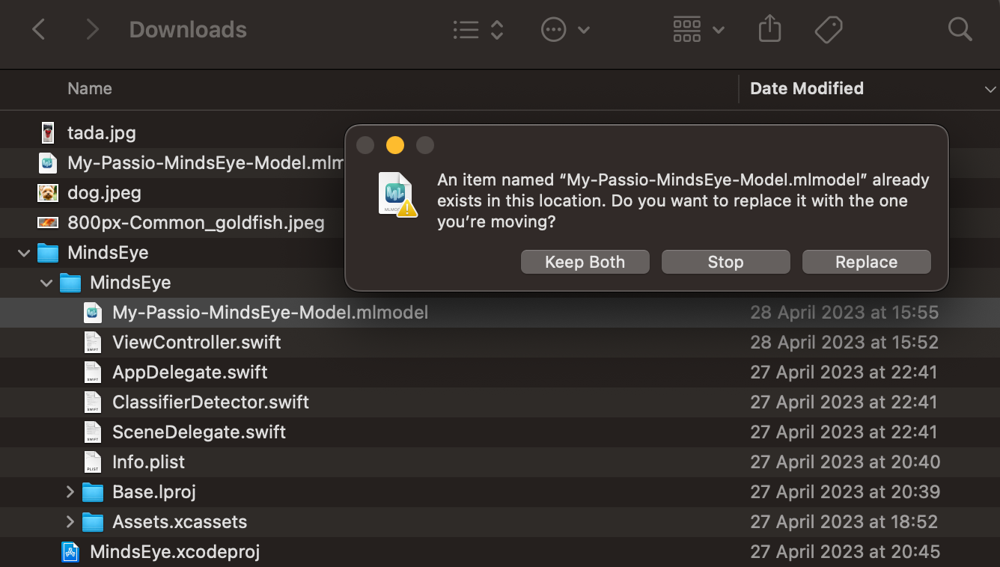

# Passio-MindsEye-iOS-Distribution

## Getting Started

1. In order to use Passio's MindsEye app first go to [MindsEye](https://labs.passiolife.com/mindseye), type in what you want to recognize, and click "Download Model".

2. Clone this repo. In a terminal run `git clone https://github.com/Passiolife/Passio-MindsEye-iOS-Distribution.git` then `cd Passio-MindsEye-iOS-Distribution/`

3. Drag `My-Passio-MindsEye-Model.mlmodel` into the directory using finder. Make sure to replace the existing file. The dialog should like the one below. Click "Replace".

4. Run `open MindsEye.xcodeproj/`

5. The project will open in Xcode. First of all navigate to the "Signing & Capabilities" page and verify that your provisioning profile is setup correctly. Sometimes you might have to log in. You should see something like this:

6. Attach your iPhone and select is as the build target

7. Run the app on your phone and recognize the items you listed in MindsEye

